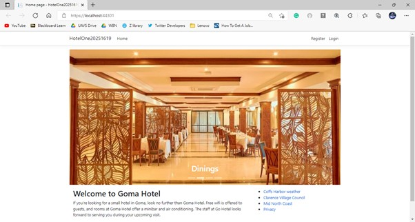

# GoMaHotel
A basic hotel website built by ASP.NET Core framework.

## Table of Contents
1. [About the projects](#about-the-project)
2. [Technologies](#technologies)
3. [Features](#features)
4. [Setup](#setup)
5. [Contributing](#contributing)

## About the project
This project is a WSU Assignment that aims to build a website for the imaginary Goma Hotel. Based on the users' roles automatically identified by the system, this website provides different functions for different users' roles. In particular, this website allows customers to search and book rooms, while administrators are allowed to manage bookings and view statistics.

## Technologies
Project is created with:
* ASP.NET Core
* Bootstrap
* SQLite

## Features
#### Non-logged-in Users
* Log in
* Register

#### Customers
* Enter/Modify personal information
* Search available rooms
* Book a room
* See all bookings

#### Administrators
* Manage bookings
  * Make a new booking
  * Edit an existing booking
  * Delete a booking
* View statistics
  * How many customers are located in each postcode
  * How many bookings have been made for each room

## Setup
#### Prerequisites
* Visual Studio 2019
* .NET Core SDK
* SQLite

#### Installation
* Open Visual Studio
* Select "Clone a repo" and enter https://github.com/longta119/GoMaHotel
* View a solution in by double-clicking the .sln file in Solution Explorer.

#### Required usernames and passwords to access the website
* Administrators

Username            | Password
------------------- | -------------------
admin@gomahotel.com | P@ssw0rd

* Customers:

|No. |Username            | Password|
|--- |------------------- | -------------------|
|1.  |customer1@mail.com  | P@ssw0rd|
|2.  |customer2@mail.com  | P@ssw0rd|
|3.  |customer3@mail.com  | P@ssw0rd|
|4.  |customer4@mail.com  | P@ssw0rd|
|5.  |customer5@mail.com  | P@ssw0rd|
|6.  |customer6@mail.com  | P@ssw0rd|
|7.  |customer7@mail.com  | P@ssw0rd|
|8.  |customer8@mail.com  | P@ssw0rd|
|3.  |customer3@mail.com  | P@ssw0rd|

## Contributing

Contributions are what make the open source community such an amazing place to learn, inspire, and create. Any contributions you make are **greatly appreciated**.

If you have a suggestion that would make this better, please fork the repo and create a pull request. You can also simply open an issue with the tag "enhancement".
Don't forget to give the project a star! Thanks again!

1. Fork the Project
2. Create your Feature Branch (`git checkout -b feature/AmazingFeature`)
3. Commit your Changes (`git commit -m 'Add some AmazingFeature'`)
4. Push to the Branch (`git push origin feature/AmazingFeature`)
5. Open a Pull Request
